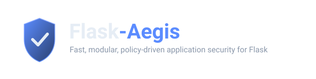

<p align="center">
  
</p>

<p align="center">
  <a href="https://github.com/null0git/flask-aegis/actions/workflows/ci.yml"></a>
  <a href="https://pypi.org/project/flask-aegis/"></a>
  <a href="https://pypi.org/project/flask-aegis/"></a>
  <a href="LICENSE"></a>
  <a href="#status"></a>
  <a href="#detection-rules"></a>
  <a href="CONTRIBUTING.md"></a>
</p>

<p align="center"><em>Fast, modular, policy-driven application security for Flask.</em></p>


```python
from flask import Flask
from flask_aegis import Aegis

app = Flask(__name__)
aegis = Aegis(app, profile="standard")
```

Flask-Aegis isn't "a Flask extension that detects SQL injection." It's a
modular application-security layer that combines request validation,
security policies, attack defenses, adaptive abuse protection, CAPTCHA
challenges, risk scoring, auditing, observability, and developer tooling —
while keeping the request path for anything you *haven't* enabled as close
to free as possible.

**Design goal:** secure by capability, configurable by policy, observable
by default, and optimized so unused security features impose minimal
overhead.

Five things are treated as first-class requirements, not bullet points:
**performance**, **false-positive control**, **explainability**,
**extensibility**, and **secure defaults**.

---

## Table of contents

- [Table of contents](#table-of-contents)
- [Status](#status)
- [Installation](#installation)
- [Quick start](#quick-start)
- [Architecture](#architecture)
- [Core concepts](#core-concepts)
  - [Policies](#policies)
  - [Profiles](#profiles)
  - [Enforcement modes](#enforcement-modes)
  - [The decision engine](#the-decision-engine)
  - [The risk engine](#the-risk-engine)
- [Per-field configuration](#per-field-configuration)
- [Detection rules](#detection-rules)
- [Interactive playground](#interactive-playground)
- [Input sanitization](#input-sanitization)
  - [Our position on frontend vs. backend sanitization](#our-position-on-frontend-vs-backend-sanitization)
  - [Backend: `flask_aegis.sanitize`](#backend-flask_aegissanitize)
  - [Wired into the pipeline: `xss_action="sanitize"`](#wired-into-the-pipeline-xss_actionsanitize)
  - [Frontend: `aegis-sanitize.js`](#frontend-aegis-sanitizejs)
- [Rate limiting](#rate-limiting)
- [CAPTCHA](#captcha)
  - [Adaptive CAPTCHA](#adaptive-captcha)
- [Security headers](#security-headers)
- [File uploads](#file-uploads)
- [SSRF protection](#ssrf-protection)
- [Business-logic protection](#business-logic-protection)
- [OpenAPI-derived validation](#openapi-derived-validation)
- [GraphQL protection](#graphql-protection)
- [WebSocket protection](#websocket-protection)
- [Config export](#config-export)
- [Events \& observability](#events--observability)
- [Plugins: custom rules \& providers](#plugins-custom-rules--providers)
- [CLI reference](#cli-reference)
  - [Versioned rule sets](#versioned-rule-sets)
- [Performance: the fast path](#performance-the-fast-path)
- [Testing](#testing)
  - [Fuzzing](#fuzzing)
  - [Property-based tests](#property-based-tests)
  - [The vulnerable test app](#the-vulnerable-test-app)
- [Threat model \& limitations](#threat-model--limitations)
- [Roadmap](#roadmap)
- [Contributing](#contributing)
- [License](#license)

---

## Status

Flask-Aegis is **alpha software (v0.7.2)**. This repository currently ships
**Phase 1 + Phase 2 + Phase 3 + Phase 4 + Phase 5 + Phase 6 + Phase 7**:

| Area | Status |
|---|---|
| Policy engine (inheritance, priorities, conditions, compilation) | ✅ Implemented |
| Decision engine (ALLOW/LOG/SANITIZE/THROTTLE/CHALLENGE/BLOCK) | ✅ Implemented |
| Risk scoring engine | ✅ Implemented |
| Detection rules: XSS, SQL injection, path traversal | ✅ Implemented |
| Detection rules: SSTI, command injection, LDAP/XPath injection, header/log injection, CSV/formula injection | ✅ Implemented |
| Detection rules: NoSQL injection, XXE, open redirect, HTTP Parameter Pollution | ✅ Implemented |
| Detection rules: insecure deserialization, SSRF-in-field, prototype pollution, Expression Language injection | ✅ Implemented |
| Detection rules: mass assignment, ReDoS, JWT weak-algorithm, homograph spoofing, XML entity bombs, SSI/LaTeX/format-string injection | ✅ Implemented |
| Zip-bomb protection (compression ratio, size, and file-count caps) | ✅ Implemented |
| Rate limiting (memory + Redis backends) | ✅ Implemented |
| CAPTCHA (reCAPTCHA v2/v3, frontend-agnostic) | ✅ Implemented |
| Security headers & cookie hardening | ✅ Implemented |
| File-upload policy (extension allowlist, double extensions, Zip Slip) | ✅ Implemented |
| SSRF defense (validator utility, not a payload scanner) | ✅ Implemented |
| Business-logic protection (quotas, replay/idempotency protection) | ✅ Implemented |
| Event system with automatic redaction | ✅ Implemented |
| Input sanitization (Python + parity-tested frontend JS module) | ✅ Implemented |
| Fuzzing harness (25 rules, traversal invariant, policy determinism) | ✅ Implemented |
| Property-based tests (hypothesis, optional `[dev]` extra) | ✅ Implemented |
| Vulnerable test app + paired security test suite | ✅ Implemented |
| **Interactive playground web app (`flask aegis playground`)** — 25 attack classes | ✅ Implemented |
| Benchmark suite (`flask aegis benchmark`) | ✅ Implemented |
| Versioned rule sets (`ruleset="2025-baseline"` / `"2026"` / `"2027"` / `"2028"` / `"2029"` / `"latest"`) | ✅ Implemented |
| CLI: `config`, `profile`, `rules`, `routes`, `audit`, `benchmark`, `ruleset`, `playground` | ✅ Implemented |
| CI audit: CAPTCHA misconfiguration, CORS wildcard+credentials detection | ✅ Implemented |
| GitHub publish-readiness: LICENSE, CI workflow, issue/PR templates, logo | ✅ Implemented |
| PEP 561 type-checking support (`py.typed`) | ✅ Implemented |
| Second CAPTCHA provider (hCaptcha) proving out the plugin architecture | ✅ Implemented |
| Custom rule categories actually usable via the policy system (`add_policy(my_check=True)`) | ✅ Implemented |
| Docker/Compose for the playground; deployment & plugin-authoring guides (`docs/`) | ✅ Implemented |
| CI/CD audit gating (`--ci` flag) | ✅ Implemented, including CAPTCHA-misconfiguration detection |
| OpenAPI-derived request validation (`flask_aegis.openapi`) | ✅ Implemented |
| GraphQL abuse protection: depth/complexity/alias/batch limits, introspection blocking | ✅ Implemented |
| WebSocket abuse protection: origin/size/rate/connection-count limits (library-agnostic) | ✅ Implemented |
| `flask aegis config export` (YAML/JSON, secret-free) | ✅ Implemented |

See [Roadmap](#roadmap) for what each phase adds.

---

## Installation

```bash
pip install flask-aegis

# With Redis-backed rate limiting for multi-process deployments:
pip install flask-aegis[redis]
```

Requires Python 3.9+ and Flask 2.3+.

---

## Quick start

```python
from flask import Flask, request, jsonify
from flask_aegis import Aegis

app = Flask(__name__)
app.config["SECRET_KEY"] = "change-me-in-production"

aegis = Aegis(app, profile="standard")

# Define a policy by extending a built-in profile and overriding a few fields.
aegis.add_policy(
    "registration",
    extends="public_form",
    rate_limit="10/minute",
    captcha="adaptive",
    risk_threshold=60,
)

@app.post("/register")
@aegis.protect("registration")
def register():
    username = request.form.get("username", "")
    return jsonify(status="ok", username=username)

if __name__ == "__main__":
    app.run()
```

> **Decorator order matters.** Flask registers a view at the moment
> `@app.route`/`@app.post`/`@app.get` is applied, so that decorator must be
> the **outermost** one — same convention as `@login_required` in
> Flask-Login:
>
> ```python
> @app.post("/register")      # outermost: registers the final wrapped view
> @aegis.protect("registration")  # innermost: wraps it first
> def register():
>     ...
> ```
>
> Reversing the order silently disables protection, because Flask would
> have already registered the unwrapped function.

---

## Architecture

Every protected request flows through one pipeline. Unprotected routes (or
routes whose resolved policy enables nothing) skip it entirely — see
[Performance](#performance-the-fast-path).

```
HTTP Request
     │
     ▼
┌──────────────────────────┐
│ Flask-Aegis              │
│                          │
│ 1. Request normalization │  ← flask_aegis.context.RequestContext
│ 2. Policy resolution     │  ← compiled at startup, O(1) lookup
│ 3. Rate limiting         │  ← flask_aegis.ratelimit
│ 4. Security rules        │  ← flask_aegis.rules (XSS/SQLi/traversal/...)
│ 5. Risk evaluation       │  ← flask_aegis.risk
│ 6. CAPTCHA / challenge   │  ← flask_aegis.captcha
│ 7. Decision engine       │  ← flask_aegis.decisions
│ 8. Event generation      │  ← flask_aegis.events
└────────────┬─────────────┘
             │
       ┌─────┴─────┐
       ▼           ▼
    BLOCK        ALLOW
   (403/429/       │
    428 resp.)     ▼
               Flask View
                    │
                    ▼
                Response
                    │
                    ▼
          Response Security Layer   ← flask_aegis.headers (headers, cookies)
```

**Module map:**

```
flask_aegis/
├── __init__.py       Aegis extension class — wires everything together
├── policy.py         Policy engine: definitions, inheritance, compilation
├── profiles.py       Built-in security profiles
├── rulesets.py       Versioned rule sets (2025-baseline / 2026 / 2027 / 2028 / 2029 / latest)
├── decisions.py      Decision engine (ALLOW..BLOCK) + enforcement modes
├── risk.py           Additive, explainable risk scoring
├── context.py        Request normalization
├── ratelimit.py      Sliding-window rate limiting, pluggable backends
├── headers.py        Response security headers & cookie hardening
├── sanitize.py       Input sanitization functions (backend)
├── upload.py         File-upload validation, Zip Slip + zip-bomb protection
├── ssrf.py           SSRF URL validator (called from app code)
├── business.py       Quotas & replay/idempotency protection
├── openapi.py        OpenAPI-derived request validation
├── graphql.py        GraphQL depth/complexity/introspection protection
├── websocket.py      WebSocket abuse protection (library-agnostic)
├── config_export.py  Secret-free config snapshot (flask aegis config export)
├── benchmark.py      Benchmark suite (flask aegis benchmark)
├── events.py         Structured events, pub/sub, auto-redaction
├── exceptions.py     Exception hierarchy
├── cli.py            `flask aegis ...` diagnostics
├── static/
│   └── aegis-sanitize.js    Frontend mirror of sanitize.py
├── playground/
│   ├── __init__.py   create_app() -- the interactive playground
│   ├── __main__.py   python -m flask_aegis.playground entry point
│   ├── attacks.py    Attack definitions + contained vulnerable sinks
│   ├── templates/index.html    Playground UI
│   └── static/{style.css,app.js}  Playground styling + fetch()-based test runner
├── rules/                                      (25 rules total)
│   ├── base.py                                 Rule base class + registry
│   ├── xss.py / sqli.py / traversal.py         AEGIS-XSS-001, -SQLI-001, -TRAVERSAL-001
│   ├── ssti.py / cmdi.py                       AEGIS-SSTI-001, -CMD-001
│   ├── ldap_xpath.py                           AEGIS-LDAP-001, -XPATH-001
│   ├── misc_injection.py                       AEGIS-HEADER-001, -CSV-001
│   ├── nosqli.py / xxe.py / xml_bomb.py        AEGIS-NOSQLI-001, -XXE-001, -XMLBOMB-001
│   ├── open_redirect.py / hpp.py               AEGIS-REDIRECT-001, -HPP-001
│   ├── deserialization.py / ssrf_field.py      AEGIS-DESERIAL-001, -SSRF-001
│   ├── proto_pollution.py / el_injection.py    AEGIS-PROTO-001, -EL-001
│   ├── mass_assignment.py / redos.py      AEGIS-MASSASSIGN-001, -REDOS-001
│   ├── jwt_weak.py / homograph.py    AEGIS-JWT-001, -HOMOGRAPH-001
│   └── engine_injection.py     AEGIS-SSI-001, -LATEX-001, -FORMATSTR-001
└── captcha/
    ├── base.py          CaptchaProvider interface
    └── recaptcha.py     reCAPTCHA v2/v3 + NullProvider
```

Every component is independently importable and independently testable —
you can use `flask_aegis.ratelimit.RateLimiter`,
`flask_aegis.ssrf.SSRFGuard`, `flask_aegis.sanitize.sanitize_html`, or
`flask_aegis.rules.traversal.safe_join_root` on their own without adopting
the whole extension.

Test infrastructure lives alongside the package:

```
tests/
├── test_*.py          Unit + integration tests (pytest), including test_playground.py
├── fuzz/                 Dependency-free fuzz harnesses (stdlib random only)
│   ├── fuzz_rules.py         All 13 rules survive adversarial input, no crashes
│   ├── fuzz_traversal.py       safe_join_root never escapes its root
│   └── fuzz_policy.py            Policy compilation is deterministic
├── property/             Idiomatic hypothesis property tests (optional [dev] extra)
└── security/              Paired vulnerable/protected route assertions
    └── test_vulnerable_app.py   against examples/vulnerable_app/

research/
├── methodology/        How the benchmark suite measures, and its limitations
└── benchmarks/           Dated, captured benchmark runs with their conditions
```

---

## Core concepts

### Policies

A **policy** is a named bundle of security settings you attach to a route.
Policies support inheritance, priority, and conditions:

```python
from flask_aegis import Policy

aegis.add_policy(
    "registration",
    csrf=True,
    xss=True,
    rate_limit="10/minute",
    captcha="adaptive",
    risk_threshold=60,
)

# Inherit from another policy and override just what differs:
aegis.add_policy(
    "password_reset",
    extends="registration",
    rate_limit="3/minute",      # tighter than registration
    risk_threshold=40,
)

@app.post("/register")
@aegis.protect("registration")
def register():
    ...
```

Every built-in [profile](#profiles) is also usable directly as a policy
name, so `@aegis.protect("strict")` works without any `add_policy()` call.

**Conditions** let a policy apply only in certain circumstances:

```python
aegis.add_policy(
    "post_only_csrf",
    csrf=True,
    condition=lambda request: request.method == "POST",
)
```

Policies are resolved once at startup into an immutable `CompiledPolicy` —
see [Performance](#performance-the-fast-path) for why that matters.

### Profiles

Profiles are ready-made defaults for common situations:

| Profile | Summary |
|---|---|
| `minimal` | Security headers only. No inspection, no rate limiting. |
| `standard` | CSRF + XSS/SQLi/traversal detection + a generous rate limit + hardened headers. **Recommended default.** |
| `strict` | Tighter limits, lower risk threshold, adaptive CAPTCHA. |
| `api` | CSRF off (token-auth APIs), injection/traversal checks stay on. |
| `public_form` | Tuned for public forms that attract spam/abuse. |
| `authentication` | Tight rate limits + adaptive CAPTCHA for login/reset endpoints. |
| `file_upload` | Traversal/Zip-Slip-oriented defaults, larger body size limit. |
| `admin` | Full input validation, no CAPTCHA (assumes auth is already in front). |
| `high_security` | Maximum enforcement — CAPTCHA on every request. Highest false-positive rate by design. |

Inspect exactly what a profile does before relying on it:

```bash
$ flask aegis profile show strict
Profile: strict
  Lower thresholds and tighter limits across the board, plus adaptive
  CAPTCHA on risky requests. Expect more false positives in exchange for
  stronger defaults; tune with per-route policies rather than dropping
  back to 'standard' wholesale.

  csrf            True
  xss             True
  sqli            True
  traversal       True
  rate_limit      30/minute
  captcha         adaptive
  risk_threshold  40
  headers         True
  max_body_size   1048576
```

### Enforcement modes

Three modes, settable globally (`Aegis(app, mode=...)`) and consulted by
every decision:

```python
Aegis(app, mode="monitor")   # detect and log, never block — safe for rollout
Aegis(app, mode="enforce")   # apply the configured action (default)
Aegis(app, mode="adaptive")  # let the risk score push borderline decisions up
```

`monitor` mode is the recommended way to introduce Flask-Aegis (or a new
rule/policy) into an existing production app: every rule fires and every
event is emitted, but nothing is ever blocked, so you can watch for false
positives before switching to `enforce`.

### The decision engine

Rules never block a request directly. Each rule reports a **finding** —
a decision plus context — and the decision engine aggregates all findings
for a request into one final `Verdict`:

```
ALLOW < LOG < SANITIZE < THROTTLE < CHALLENGE < BLOCK
```

The highest-severity finding wins. In `adaptive` mode, the risk score can
push a borderline decision up by one tier (e.g. `LOG` → `THROTTLE` at
risk ≥ 60), but adaptive mode never jumps straight to `BLOCK` — a single
noisy rule can't cause a hard outage.

`BLOCK` → HTTP 403, `THROTTLE` → HTTP 429, `CHALLENGE` → HTTP 428, all as
a JSON body:

```json
{"error": "blocked_by_aegis", "reason": "Potential XSS payload in field 'username'", "rule": "AEGIS-XSS-001"}
```

### The risk engine

A small, deliberately transparent additive scoring model — not a black
box. Every score is traceable back to the exact signals that produced it:

```python
from flask_aegis.risk import RiskEngine

engine = RiskEngine()
ctx = engine.new_context()
ctx.add("rate_limit_violation")     # +30
ctx.add("suspicious_input")          # +20
ctx.score   # 50
ctx.band    # 'MEDIUM'
ctx.explain()
# [{'signal': 'rate_limit_violation', 'weight': 30, 'meta': {}},
#  {'signal': 'suspicious_input', 'weight': 20, 'meta': {}}]
```

Default weights and bands:

| Signal | Weight |
|---|---|
| `suspicious_input` | +20 |
| `rate_limit_violation` | +30 |
| `repeated_failure` | +15 |
| `suspicious_url` | +30 |
| `invalid_captcha` | +25 |
| `known_bad_ua` | +20 |
| `new_identity` | +10 |

| Score | Band |
|---|---|
| 0–29 | LOW |
| 30–59 | MEDIUM |
| 60–89 | HIGH |
| 90+ | CRITICAL |

Both weights and thresholds are fully configurable:

```python
from flask_aegis.risk import RiskEngine

Aegis(app).risk_engine = RiskEngine(
    weights={"rate_limit_violation": 40},
    thresholds=[(0, 39, "LOW"), (40, 69, "MEDIUM"), (70, None, "HIGH")],
)
```

---

## Per-field configuration

Flask-Aegis avoids the common mistake of applying one global input filter
to every field. Configure exceptions where they're actually needed:

```python
# 'username' should never contain markup.
aegis.field("register", "username", max_length=32, xss=True)

# 'bio' is a rich-text field — exempt it from the XSS rule, but pair
# this with an actual HTML sanitizer (e.g. bleach) before storing/rendering.
aegis.field("register", "bio", max_length=5000, html=True)

# A field with a legitimate reason to mention SQL syntax in free text
# (e.g. a code-review comment field) can opt out of the SQLi rule too.
aegis.field("comments", "body", sqli=False)
```

`aegis.field(route_or_endpoint, field_name, **options)` accepts:

| Option | Effect |
|---|---|
| `xss` | `False` disables the XSS rule for this field. |
| `html` | `True` is shorthand for "this field is expected to contain markup" — also disables the XSS rule, but documents *why*. |
| `sqli` | `False` disables the SQLi rule for this field. |
| `xss_action` | `"sanitize"` to `SANITIZE` instead of `BLOCK` when the XSS rule fires (sanitization logic is your responsibility to wire up in Phase 2/plugins). |
| `max_length` | Reserved for the upcoming length-validation rule (Phase 2). |

---

## Detection rules

Every rule has a stable ID, explicit severity/category, and documents its
own false-positive conditions and limitations — see each rule's
`RuleMeta` in source, or run `flask aegis rules`:

| Rule ID | Category | Severity | Enabled by default in |
|---|---|---|---|
| `AEGIS-XSS-001` | `xss` | high | `standard`, `strict`, `public_form`, `authentication`, `admin`, `high_security` |
| `AEGIS-SQLI-001` | `sqli` | critical | `standard`, `strict`, `api`, `public_form`, `authentication`, `admin`, `high_security` |
| `AEGIS-TRAVERSAL-001` | `traversal` | high | `standard`, `strict`, `api`, `file_upload`, `admin`, `high_security` |
| `AEGIS-SSTI-001` | `ssti` | critical | `standard`, `strict`, `api`, `public_form`, `admin`, `high_security` |
| `AEGIS-CMD-001` | `cmdi` | critical | `standard`, `strict`, `api`, `public_form`, `admin`, `high_security` |
| `AEGIS-LDAP-001` | `ldap` | high | `strict`, `authentication`, `admin`, `high_security` |
| `AEGIS-XPATH-001` | `xpath` | high | `strict`, `admin`, `high_security` |
| `AEGIS-HEADER-001` | `header_injection` | high | `standard`, `strict`, `api`, `public_form`, `authentication`, `file_upload`, `admin`, `high_security` |
| `AEGIS-CSV-001` | `csv_injection` | medium | none by default (opt-in per field — see below) |
| `AEGIS-NOSQLI-001` | `nosqli` | critical | `standard`, `strict`, `api`, `authentication`, `admin`, `high_security` |
| `AEGIS-XXE-001` | `xxe` | critical | `standard`, `strict`, `api`, `file_upload`, `admin`, `high_security` |
| `AEGIS-REDIRECT-001` | `open_redirect` | medium | category on in `strict`/`authentication`/`admin`/`high_security`; field still needs explicit opt-in everywhere — see below |
| `AEGIS-HPP-001` | `hpp` | medium | `standard`, `strict`, `api`, `public_form`, `authentication`, `admin`, `high_security` |
| `AEGIS-DESERIAL-001` | `deserialization` | critical | `standard`, `strict`, `api`, `public_form`, `authentication`, `file_upload`, `admin`, `high_security` |
| `AEGIS-SSRF-001` | `ssrf_field` | critical | category on in `strict`/`authentication`/`admin`/`high_security`; field still needs explicit opt-in everywhere — see below |
| `AEGIS-PROTO-001` | `proto_pollution` | high | `standard`, `strict`, `api`, `public_form`, `admin`, `high_security` |
| `AEGIS-EL-001` | `el_injection` | critical | `standard`, `strict`, `api`, `public_form`, `admin`, `high_security` |
| `AEGIS-MASSASSIGN-001` | `mass_assignment` | high | `standard`, `strict`, `api`, `public_form`, `authentication`, `admin`, `high_security` |
| `AEGIS-REDOS-001` | `redos` | high | category on in `strict`/`high_security`; field still needs explicit opt-in everywhere |
| `AEGIS-JWT-001` | `jwt_weak` | critical | `standard`, `strict`, `api`, `authentication`, `admin`, `high_security` |
| `AEGIS-HOMOGRAPH-001` | `homograph` | medium | category on in `strict`/`authentication`/`high_security`; field still needs explicit opt-in everywhere |
| `AEGIS-XMLBOMB-001` | `xml_bomb` | high | `standard`, `strict`, `api`, `public_form`, `authentication`, `file_upload`, `admin`, `high_security` |
| `AEGIS-SSI-001` | `ssi_injection` | high | category on in `strict`/`high_security`; field still needs explicit opt-in everywhere |
| `AEGIS-LATEX-001` | `latex_injection` | high | category on in `strict`/`high_security`; field still needs explicit opt-in everywhere |
| `AEGIS-FORMATSTR-001` | `format_string` | high | category on in `strict`/`high_security`; field still needs explicit opt-in everywhere |

```bash
$ flask aegis rules
AEGIS-XSS-001  [high]  (xss)
  Detects common cross-site scripting payload patterns (script tags,
  event-handler attributes, javascript: URIs, data: URIs carrying HTML)
  in request parameters, form fields, and JSON bodies.

AEGIS-SQLI-001  [critical]  (sqli)
  Detects common SQL injection patterns: UNION-based, boolean-based,
  time-based (SLEEP/BENCHMARK), stacked queries, and comment-based
  statement termination.

AEGIS-TRAVERSAL-001  [high]  (traversal)
  Detects path traversal sequences ('../', '..\\') in request parameters
  and path segments, including URL-encoded and double-encoded forms.

AEGIS-SSTI-001  [critical]  (ssti)
  Detects server-side template injection probing across the common
  delimiter families: Jinja2/Twig ({{ }}, ), ERB (<%= %>), and
  generic ${...}/#{...} interpolation, including attribute-chain
  payloads targeting Python's object model (__class__, __mro__,
  __globals__).

AEGIS-CMD-001  [critical]  (cmdi)
  Detects OS command injection patterns: shell metacharacter chaining
  (;, &&, ||, |), command substitution ($(...), backticks), and common
  post-exploitation commands appended to input (whoami, cat, wget, nc,
  bash).

AEGIS-LDAP-001  [high]  (ldap)
  Detects LDAP filter injection: boolean filter chaining, wildcard
  attribute injection, and hex-escaped metacharacters.

AEGIS-XPATH-001  [high]  (xpath)
  Detects XPath injection: boolean tautologies, union-style node-set
  combination, and count()-based blind probing.

AEGIS-HEADER-001  [high]  (header_injection)
  Detects CRLF sequences (raw or URL-encoded) destined for response
  headers, redirect targets, or log lines.

AEGIS-CSV-001  [medium]  (csv_injection)
  Detects CSV/formula injection in fields that will later be exported
  to a spreadsheet. Opt-in only -- see false-positive notes.

AEGIS-NOSQLI-001  [critical]  (nosqli)
  Detects NoSQL injection: MongoDB query operators ($ne, $where, $gt, ...)
  submitted as a string where a scalar was expected, plus JS-evaluation
  gadgets.

AEGIS-XXE-001  [critical]  (xxe)
  Detects XML external entity (XXE) primitives in XML request bodies:
  DOCTYPE, ENTITY, and SYSTEM/PUBLIC external references, including
  parameter-entity exfiltration techniques.

AEGIS-REDIRECT-001  [medium]  (open_redirect)
  Detects open-redirect bypass techniques (protocol-relative URLs,
  backslash tricks, embedded credentials) in fields explicitly opted
  in as redirect targets.

AEGIS-HPP-001  [medium]  (hpp)
  Detects HTTP Parameter Pollution: a query-string or form field
  submitted more than once with different values.

AEGIS-DESERIAL-001  [critical]  (deserialization)
  Detects insecure deserialization payloads: Python pickle GLOBAL-opcode
  gadgets and protocol headers, Java serialized-object stream headers,
  and PHP serialize() notation -- checked both raw and base64-decoded.

AEGIS-SSRF-001  [critical]  (ssrf_field)
  Flags a field whose value looks like a URL pointing at a loopback,
  link-local (including the cloud metadata address), or private
  address, or using a non-HTTP(S) scheme. Opt-in per field.

AEGIS-PROTO-001  [high]  (proto_pollution)
  Detects prototype pollution primitives (__proto__,
  constructor.prototype) that could pollute a downstream JS consumer of
  your API's JSON output.

AEGIS-EL-001  [critical]  (el_injection)
  Detects Java/Spring EL and OGNL injection: reflective Runtime/
  ProcessBuilder access, OGNL static-method call syntax, and
  Spring4Shell-style class-loader access gadgets.

AEGIS-MASSASSIGN-001  [high]  (mass_assignment)
  Flags a request body containing a key naming a privileged attribute
  (role, is_admin, permissions, password_hash, balance, ...) that a
  bulk-assign handler could set without an explicit allowlist.

AEGIS-REDOS-001  [high]  (redos)
  Detects regex patterns with catastrophic backtracking potential:
  nested quantifiers, overlapping alternation under a quantifier.
  Opt-in per field.

AEGIS-JWT-001  [critical]  (jwt_weak)
  Detects a JWT whose header declares the 'none' algorithm or omits
  'alg' entirely -- the classic unsigned-token signature bypass.
  Checks form/query fields and the Authorization header.

AEGIS-HOMOGRAPH-001  [medium]  (homograph)
  Detects mixed-script spoofing: Latin letters mixed with visually-
  confusable Cyrillic/Greek look-alikes, the technique behind
  lookalike domains and impersonation usernames. Opt-in per field.

AEGIS-XMLBOMB-001  [high]  (xml_bomb)
  Detects XML entity expansion bombs ('billion laughs'): internal
  ENTITY definitions that reference each other, or an unusually high
  definition count.

AEGIS-SSI-001  [high]  (ssi_injection)
  Detects Server-Side Includes injection: <!--#exec/include/echo/
  config/fsize/flastmod --> directives. Opt-in per field.

AEGIS-LATEX-001  [high]  (latex_injection)
  Detects LaTeX injection: \write18 (shell escape), \input/\include
  (file inclusion), \openout (file write), \catcode. Opt-in per field.

AEGIS-FORMATSTR-001  [high]  (format_string)
  Detects C-style format string injection: %n (memory write), long
  runs of %s/%x, positional specifiers. Opt-in per field.
```

CSV/formula injection is deliberately **opt-in per field**, not enabled by
any profile, because the pattern (`=`, `+`, `-`, `@` as a leading
character) collides constantly with legitimate data — phone numbers,
negative amounts, signature blocks. Enable it only on fields you know are
exported to XLSX/CSV:

```python
aegis.field("export_row", "notes", csv_injection=True)
```

Open redirect, SSRF-field, ReDoS, homograph, SSI, LaTeX, and
format-string detection all use the same **double opt-in**: even where a
profile enables the category on a policy, each rule's own per-field
default stays off — you must also mark the specific field that's
actually relevant to that check:

```python
aegis.add_policy("login", extends="authentication", open_redirect=True)
aegis.field("login", "next", open_redirect=True)

aegis.add_policy("webhooks", extends="standard", ssrf_field=True)
aegis.field("register_webhook", "callback_url", ssrf_field=True)

aegis.add_policy("search", extends="standard", redos=True)
aegis.field("search", "custom_pattern", redos=True)
```

`AEGIS-SSRF-001` is the automatic-detection complement to
`flask_aegis.ssrf.SSRFGuard` (see [SSRF protection](#ssrf-protection)) —
this rule flags the input shape at submission time; `SSRFGuard` protects
the actual outbound fetch, including against DNS changing between the
two checks. Use both.

LDAP and XPath injection are similarly narrow: enable them only on routes
that actually build an LDAP filter or XPath expression from user input
(`ldap=True` / `xpath=True` in a policy, or use the `authentication`/
`admin`/`strict` profiles, which already turn on the relevant one).

**Important:** these rules are defense-in-depth signals, not a substitute
for the actually-correct defense in each case:

- XSS → output encoding (Jinja autoescaping is on by default) + a strict CSP.
- SQL injection → parameterized queries / an ORM. Never string-concatenated SQL.
- SSTI → never call `render_template_string`/an f-string with user input as *template source*; user input is data, not template.
- Command injection → `subprocess.run([...], shell=False)` with an argument list, never a shell string built from user input.
- LDAP/XPath injection → proper filter-escaping / parameterized expressions, not string concatenation.
- NoSQL injection → validate that a filter field is the scalar type you expect before passing it to the driver; reject dicts entirely where a string was expected.
- XXE → disable DTD processing and external entity resolution in your XML parser entirely (e.g. `defusedxml`), regardless of this rule.
- Open redirect → validate the redirect target against an explicit allowlist of hosts/paths — this rule catches known bypass *techniques*, not "any external URL", which would false-positive on every legitimate external redirect.
- HTTP Parameter Pollution → ensure every layer of your stack (validation, business logic, any downstream service you proxy to) agrees on which duplicate value wins.
- Path traversal → use `flask_aegis.rules.traversal.safe_join_root()` (or
  Werkzeug's `safe_join`) whenever you build a filesystem path from user
  input, rather than relying on detection alone.

```python
from flask_aegis.rules.traversal import safe_join_root

resolved = safe_join_root("/var/app/uploads", request.args.get("path", ""))
if resolved is None:
    abort(400)
```

---

## Interactive playground

An interactive, browser-based UI to test every attack class above, live
— side by side against unprotected code:

```bash
flask aegis playground
# or, without needing FLASK_APP set:
python -m flask_aegis.playground
```

Then open **http://127.0.0.1:5050**. Each attack has a card with a
description, its real-world mitigation, a pre-filled example payload, a
**Protected** toggle, and a result panel showing the HTTP status, the
blocking rule ID, or (for CSV injection) the sanitized value instead of
a block:

```
$ flask aegis playground
Flask-Aegis playground running at http://127.0.0.1:5050
Local testing only -- do not expose this publicly. Press CTRL+C to stop.
 * Running on http://127.0.0.1:5050
```

Toggling "Protected" off sends the identical payload to `/api/vuln/<id>`
— a genuinely vulnerable route, contained the same way as
`examples/vulnerable_app/` (in-memory SQLite for SQLi, a temp sandbox
for traversal, a simulated sink for command injection, simulated
resolution for XXE, no real browser navigation for open redirect — see
`flask_aegis/playground/attacks.py` and `flask_aegis/playground/README.md`
for the full containment model per attack class). Toggling it on sends
the same payload through the identical code wrapped in
`@aegis.protect(...)`.

⚠️ **Local testing only.** Binds to `127.0.0.1` by default — never
expose this publicly; see the warnings in
`flask_aegis/playground/README.md` before running it, particularly for
the SSTI card, which genuinely evaluates Jinja server-side.

---

## Input sanitization

Detection rules answer "is this dangerous?" and default to **block**.
Sanitization answers "how do I make this safe to keep?" for the fields
where blocking is the wrong call — a rich-text bio, a display name that
just needs stray markup stripped rather than the whole submission
rejected, a value headed for a spreadsheet export.

### Our position on frontend vs. backend sanitization

**Sanitize on the backend — always, no exceptions. Sanitize on the
frontend too, but only as a UX nicety, never as the security boundary.**

A browser is not the only thing that can talk to your API. `curl`,
a script, a modified client, or an attacker's own tooling can send raw
bytes straight to your endpoint with your JavaScript never in the loop.
So Flask-Aegis ships two implementations on purpose:

- **`flask_aegis.sanitize`** (Python) — the actual defense. This is what
  runs regardless of what sent the request.
- **`flask_aegis/static/aegis-sanitize.js`** (vanilla JS, no dependencies)
  — a mirror of the same functions, for two narrow purposes: instant
  feedback in a live preview, and avoiding a round-trip to the backend
  that would just bounce back with a SANITIZE/BLOCK response anyway.

The two are kept **behavior-identical** on purpose — see
`tests/test_sanitize_parity.py`, which runs the same inputs through both
implementations (Python directly, JS via Node) and asserts equal output.
A client-side preview that shows something different from what actually
gets stored is worse than no preview at all, because it trains users to
trust output your backend doesn't agree with. If you only have time to
wire up one side, wire up the backend — the frontend module is an
enhancement, not a requirement.

### Backend: `flask_aegis.sanitize`

```python
from flask_aegis.sanitize import (
    escape_html, sanitize_html, sanitize_filename, sanitize_identifier,
    sanitize_csv_field, sanitize_url, strip_control_chars,
    normalize_whitespace, normalize_unicode,
)

escape_html("<b>hi</b>")
# '&lt;b&gt;hi&lt;/b&gt;'  -- for fields that should never contain markup

sanitize_html("hi <script>alert(1)</script> <b>bold</b>")
# 'hi  <b>bold</b>'  -- strips disallowed tags/attrs, keeps a safe subset

sanitize_filename("../../etc/passwd")
# '_.._etc_passwd'  -- pair with safe_join_root() for actual traversal safety

sanitize_csv_field("=cmd|'/c calc'!A1")
# "'=cmd|'/c calc'!A1"  -- neutralizes spreadsheet formula injection

sanitize_url("javascript:alert(1)")
# None  -- format check only; use SSRFGuard before fetching the result
```

`sanitize_html` takes an allowlist, not a denylist — you specify what's
permitted, everything else is stripped:

```python
sanitize_html(
    value,
    allowed_tags={"p", "b", "i", "a"},
    allowed_attrs={"a": {"href"}},
)
```

For anything beyond basic formatting tags (embedded media, style
attributes, complex nesting), use a dedicated library like `bleach`
instead — `sanitize_html` intentionally stays small and dependency-free
rather than trying to be a full HTML sanitizer.

### Wired into the pipeline: `xss_action="sanitize"`

Rather than calling these functions manually in every view, set a field
to sanitize instead of block, and the pipeline does it for you:

```python
aegis.field("comment", "body", xss_action="sanitize")

@app.post("/comment")
@aegis.protect("comments")
def comment():
    # aegis.sanitized() returns the cleaned value if the XSS rule fired
    # (with a SANITIZE decision instead of BLOCK); falls back to the raw
    # value otherwise, since a clean submission was never flagged at all.
    body = aegis.sanitized("body", default=request.form.get("body", ""))
    save_comment(body)
    return jsonify(status="ok")
```

The request is never blocked — it reaches your view either way. What
changes is whether `aegis.sanitized(field_name)` returns a cleaned value
(finding fired) or `None`/your `default` (nothing to clean). The CSV
injection rule (`AEGIS-CSV-001`) uses `SANITIZE` by default for the same
reason — see [Detection rules](#detection-rules).

Register a sanitizer for your own rule, or override the default for a
built-in one:

```python
aegis.register_sanitizer("AEGIS-XSS-001", my_custom_html_sanitizer)
```

### Frontend: `aegis-sanitize.js`

Served automatically at `/_aegis/static/aegis-sanitize.js` once Aegis is
initialized — no separate build step or static-file wiring needed:

```jinja
<script src="{{ url_for('aegis_static.static', filename='aegis-sanitize.js') }}"></script>
<script>
  const preview = AegisSanitize.sanitizeHtml(document.getElementById("body").value);
  document.getElementById("preview").innerHTML = preview;
</script>
```

Also usable as an ES module (`import * as AegisSanitize from
'./aegis-sanitize.js'`) or via `require()` in a Node-based frontend
build. Same function names as the Python module:
`escapeHtml`, `sanitizeHtml`, `stripControlChars`, `normalizeWhitespace`,
`normalizeUnicode`, `sanitizeFilename`, `sanitizeIdentifier`,
`sanitizeCsvField`, `sanitizeUrl`.

See `examples/templates/comment_form.html` and
`examples/basic_app.py`'s `/comment` + `/comment-form` routes for a
complete working example (live preview client-side, authoritative
sanitization server-side, same result either way).

---

## Rate limiting

```python
# Attach a standalone rate limit to a route without a full policy:
aegis.rate_limit("/login", "5/minute", scope="ip")

# Or as part of a policy:
aegis.add_policy("login", extends="authentication", rate_limit="5/minute")
```

Spec format is `"<count>/<second|minute|hour|day>"`. The default backend
is in-process memory (fine for development or a single worker); for
multi-process/multi-node deployments, use Redis:

```python
from flask_aegis.ratelimit import RedisBackend

aegis = Aegis(
    app,
    profile="standard",
    rate_limit_backend=RedisBackend(url="redis://localhost:6379/0"),
)
```

Custom backends only need to implement one method:

```python
class MyBackend:
    def hit(self, key: str, limit: int, window_seconds: int):
        ...  # return a HitResult(allowed, remaining, reset_after)
```

---

## CAPTCHA

CAPTCHA is provider-based and frontend-agnostic. The **critical security
rule**: the site key is public and safe for the frontend; the secret key
is backend-only and is never exposed through Jinja, an API response,
JavaScript, or client-side environment variables.

Two providers ship built in — reCAPTCHA and hCaptcha — as a deliberate
proof that the provider interface isn't shaped around one vendor. See
`docs/PLUGINS.md` if you want to add a third.

```python
# reCAPTCHA
aegis = Aegis(
    app,
    captcha={
        "provider": "recaptcha",
        "site_key": "6Lc...",
        "secret_key": "6Lc...",   # never sent to the client
        "version": "v2",          # or "v3"
    },
)

# hCaptcha (same shape, no version parameter -- see note below)
aegis = Aegis(
    app,
    captcha={
        "provider": "hcaptcha",
        "site_key": "...",
        "secret_key": "...",      # never sent to the client
    },
)
```

Each provider only accepts the keyword arguments its own `__init__`
declares — `build_provider()` passes your `captcha={...}` dict straight
through to the selected provider's constructor, so a `version` key
meant for reCAPTCHA raises a `TypeError` if passed while
`provider="hcaptcha"` is selected. Check the specific provider's class
(`flask_aegis/captcha/recaptcha.py`, `flask_aegis/captcha/hcaptcha.py`)
for the exact parameters it accepts.

**Jinja:**

```jinja
<form method="post">
  {{ aegis.captcha() }}
  <button type="submit">Submit</button>
</form>
```

**React / Vue / Angular / mobile:** fetch only the safe, public config
from your own API endpoint — never the secret:

```python
@app.get("/api/captcha-config")
def captcha_config():
    return jsonify(aegis.captcha_public_config())
    # -> {"provider": "recaptcha", "site_key": "6Lc...", "version": "v2"}
```

The backend still performs verification — the frontend only ever renders
the widget and forwards the resulting token.

### Adaptive CAPTCHA

CAPTCHA doesn't have to apply to everyone:

```python
aegis.add_policy(
    "registration",
    captcha="adaptive",       # only challenge risky requests
    risk_threshold=60,        # ...where "risky" means risk score >= 60
)
```

```
Normal request        -> ALLOW
Suspicious request     -> CHALLENGE (CAPTCHA)
Highly suspicious       -> CHALLENGE + rate limited
Severe abuse              -> BLOCK
```

Set `captcha="always"` to challenge every request regardless of risk
(this is what the `high_security` profile does).

---

## Security headers

```python
aegis.headers(
    csp=True,                                   # or a custom CSP string
    hsts=True,
    hsts_max_age=31536000,
    nosniff=True,
    frame_protection="SAMEORIGIN",              # or "DENY" / "off"
    referrer_policy="strict-origin-when-cross-origin",
    permissions_policy="geolocation=()",
    secure_cookies=True,                        # forces Secure/HttpOnly/SameSite
)
```

Applied via `after_request`, so it runs for every response — including
ones produced by error handlers — regardless of which policy (if any) was
attached to the route that produced them.

---

## File uploads

File-upload defenses are exposed as explicit validation functions you call
around a `werkzeug.datastructures.FileStorage`, rather than hooked
transparently into the request pipeline — upload handling varies too much
across apps (streaming vs. buffered, local disk vs. object storage,
different storage backends) for one-size-fits-all middleware:

```python
from flask_aegis.upload import UploadPolicy, UploadRejected, validate_upload

photo_policy = UploadPolicy(
    allowed_extensions={"png", "jpg", "jpeg"},
    max_size_bytes=5 * 1024 * 1024,
    block_double_extensions=True,   # rejects "photo.jpg.php"
    allowed_mimetypes={"image/png", "image/jpeg"},
)

@app.post("/avatar")
def upload_avatar():
    file = request.files["avatar"]
    try:
        validate_upload(file, photo_policy)
    except UploadRejected as exc:
        return jsonify(error=str(exc)), 400
    file.save(f"/var/app/uploads/{file.filename}")
    return jsonify(ok=True)
```

`validate_upload` checks (in order): filename presence, absence of path
separators, disallowed characters, reserved Windows device names
(`CON`, `PRN`, `NUL`, ...), extension allowlist, double-extension
detection, MIME type (if configured), and size.

**Zip Slip protection** for archive extraction:

```python
from flask_aegis.upload import safe_extract_zip, UploadRejected

try:
    extracted_files = safe_extract_zip(uploaded_zip_path, "/var/app/extracted")
except UploadRejected:
    abort(400, "Archive contains an unsafe path")
```

Every archive member's destination is checked against
`flask_aegis.rules.traversal.safe_join_root` before extraction — a member
like `../../../../etc/cron.d/evil` is rejected instead of written outside
the destination directory.

**Decompression bomb protection** runs before any bytes are written, using
the archive's central-directory metadata alone:

```python
safe_extract_zip(
    uploaded_zip_path, "/var/app/extracted",
    max_ratio=100.0,                        # reject >100x compression ratio per member
    max_uncompressed_size=1 * 1024**3,       # reject >1GB total uncompressed
    max_total_members=10_000,                # reject an implausible entry count
)
```

All three checks (ratio, total size, member count) run against every
member's metadata before extraction starts, so a malicious archive is
rejected without ever writing a single byte to disk — verified against a
real "small file, huge decompressed size" bomb and a real file-count
flood, not just asserted.

---

## SSRF protection

SSRF is **not** implemented as a request-body payload scanner — a URL that
"looks suspicious" in a form field isn't the vulnerability. The
vulnerability is *your server code making an outbound request to a URL
influenced by user input*. So Flask-Aegis gives you a validator to call
at the exact point you're about to make that request:

```python
from flask_aegis.ssrf import SSRFGuard, SSRFBlocked

guard = SSRFGuard()  # blocks loopback, link-local, private ranges, non-http(s) schemes

@app.post("/import-avatar-from-url")
def import_avatar():
    url = request.form["url"]
    try:
        guard.validate_url(url)
    except SSRFBlocked as exc:
        return jsonify(error=str(exc)), 400

    resp = requests.get(url, timeout=5)
    ...
```

For the strongest guarantee, pair this with an explicit allowlist when the
set of legitimate destinations is known (e.g. a fixed set of webhook
partners):

```python
guard = SSRFGuard(allowed_hosts={"hooks.partner-a.com", "hooks.partner-b.com"})
```

`SSRFGuard` blocks by default: non-HTTP(S) schemes, loopback addresses,
link-local addresses (including the `169.254.169.254` cloud metadata
endpoint), RFC1918 private ranges, and a set of commonly-internal ports
(SMTP, Redis, Memcached, Elasticsearch, the unauthenticated Docker socket
port). Pass `allow_private=True` only for deployments where internal
service-to-service calls through this validator are an intentional,
trusted pattern.

---

## Business-logic protection

Quotas and replay (duplicate-operation) protection, attached via a
separate decorator since these are scoped to a specific *action* — often
keyed by an authenticated user, not just an IP — rather than a route's
general request-security posture:

```python
@app.post("/transfer")
@aegis.protect_action(
    "transfer",
    quota="10/day",
    dedupe_header="Idempotency-Key",
    identity=lambda: session["user_id"],
)
def transfer():
    ...
```

- **Quota** (`quota="10/day"`) limits how often a given identity can
  perform this specific action — independent of, and typically much
  tighter than, the route's general rate limit.
- **Replay protection** (`dedupe_header="Idempotency-Key"`) treats a
  repeated header value from the same identity within 24 hours as a
  duplicate request rather than a new one, the same pattern used by
  payment-processor APIs.

Violations raise `flask_aegis.business.BusinessRuleViolation` and are
converted automatically into a JSON error response: HTTP 429
(`business_rule_quota_exceeded`) for quota violations, HTTP 409
(`business_rule_duplicate_request`) for replay detection.

Can be stacked with `@aegis.protect(...)`:

```python
@app.post("/transfer")
@aegis.protect_action("transfer", quota="10/day", dedupe_header="Idempotency-Key")
@aegis.protect("authentication")
def transfer():
    ...
```

`ReplayGuard` and the quota counter are in-memory by default (per-process
— fine for a single worker). For multi-process deployments, back
`aegis.business_rules.rate_limiter` with `RedisBackend` the same way you
would the main rate limiter (see [Rate limiting](#rate-limiting)).

---

## OpenAPI-derived validation

`flask_aegis.openapi` derives request validation from an OpenAPI 3.x
spec — required parameters, types, enums, string/number constraints,
and request-body schema — without adding a JSON Schema dependency for
it. This is a deliberately small validator covering the constructs that
appear in real-world specs (`type`, `required`, `enum`, `minLength`/
`maxLength`/`pattern`, `minimum`/`maximum`, array `items`, nested
`object`/`properties`), not a complete JSON Schema implementation — no
`$ref` resolution across files, no `allOf`/`oneOf`/`anyOf` composition.
For those, use the `jsonschema` package directly against the same spec.

```python
from flask_aegis.openapi import OpenAPIGuard, OpenAPIValidationError

guard = OpenAPIGuard.from_file("openapi.yaml")  # or OpenAPIGuard(spec_dict)

@app.errorhandler(OpenAPIValidationError)
def handle_schema_error(e):
    return jsonify(error="schema_validation_failed", details=e.errors), 400

@app.post("/pets")
@guard.validate("POST", "/pets")
def create_pet():
    ...
```

`guard.validate(method, path_template)` matches against the spec's own
path template (`/pets/{petId}`, OpenAPI's `{param}` syntax) — this is
deliberately not inferred from your Flask route's URL converters
(`<int:pet_id>`), since that mapping isn't always 1:1. You call
`.check(method, path_template, query_params, path_params, body)`
directly if you want the list of errors without the decorator raising.

`OpenAPIValidationError.errors` is a list of every violation found in
one pass, not just the first — a client gets the complete picture in
one round-trip rather than fixing issues one at a time.

---

## GraphQL protection

`flask_aegis.graphql` protects a GraphQL endpoint against the attack
shapes specific to a single-endpoint, client-specified-query API: depth
bombs, field-count/complexity bombs, alias-based amplification, batch
abuse, and introspection probing. It's a small, dependency-free
tokenizer (brace-depth counting + field-name extraction) rather than a
full GraphQL parser — sufficient for limiting these attack shapes
without needing the query to be 100% syntactically valid GraphQL first.

```python
from flask_aegis.graphql import GraphQLGuard, GraphQLBlocked

guard = GraphQLGuard(
    max_depth=10,
    max_complexity=200,      # total field-selection count across the query
    max_aliases=15,          # caps alias-based cost amplification
    allow_introspection=False,
    max_batch_size=1,        # reject batched ([{query: ...}, ...]) requests beyond this
)

@app.errorhandler(GraphQLBlocked)
def handle_graphql_blocked(e):
    return jsonify(error=e.reason, message=str(e)), 400

@app.post("/graphql")
@guard.protect()
def graphql_endpoint():
    ...
```

`max_complexity` counts field selections as a transparent proxy for
query cost — not a replacement for real per-field cost weighting via
your GraphQL execution library if your schema has fields with wildly
different actual costs (a `user { id }` selection and a
`user { recommendedProducts(limit: 1000) { ... } }` selection count the
same toward this limit). Use `guard.analyze(query)` directly if you want
the raw `QueryAnalysis` (depth, field count, alias count, whether
introspection fields were used) to feed into your own cost model.

---

## WebSocket protection

Flask has no built-in WebSocket support, so `flask_aegis.websocket`
is intentionally connector-agnostic: `WebSocketGuard` is a plain Python
class with no dependency on a specific WS library (Flask-Sock,
Flask-SocketIO, or anything else) — call its methods from inside
whichever library's connection/message handler you're already using.

```python
from flask_sock import Sock
from flask_aegis.websocket import WebSocketGuard, WebSocketBlocked

sock = Sock(app)
guard = WebSocketGuard(
    allowed_origins={"https://example.com"},
    max_message_size=64 * 1024,
    max_messages_per_minute=120,
    max_concurrent_connections=1000,
)

@sock.route("/ws")
def ws_handler(ws):
    if not guard.validate_origin(request.headers.get("Origin")):
        return  # reject the connection before ever accepting it
    connection_id = guard.connect()
    try:
        while True:
            message = ws.receive()
            if message is None:
                break
            try:
                guard.check_message(connection_id, message)
            except WebSocketBlocked as exc:
                ws.send(str(exc))
                break
            handle_message(message)
    finally:
        guard.disconnect(connection_id)  # always release the slot
```

**Why origin validation matters here specifically:** WebSocket
connections are not subject to the same-origin policy the way
`fetch()`/XHR requests are — a page on any origin can open a WS
connection to your endpoint unless you check the `Origin` header
yourself. `allowed_origins=None` disables the check entirely (fine for
a same-origin-only deployment behind a reverse proxy that already
enforces this; not recommended for a browser-facing endpoint otherwise).

---

## Config export

```bash
$ flask aegis config          # unchanged: quick profile/mode/ruleset summary
$ flask aegis config show     # same as above, explicit subcommand
$ flask aegis config export   # full configuration snapshot, YAML by default
$ flask aegis config export --format json -o aegis-config.json
```

Exports every compiled policy's resolved settings, the active profile/
mode/ruleset, the security-headers configuration, which CAPTCHA
provider is active, and the rate limiter's backend type:

```yaml
flask_aegis_version: 0.6.0
profile: standard
mode: enforce
ruleset: latest
captcha_provider: recaptcha
rate_limiter_backend: MemoryBackend
security_headers:
  csp: true
  hsts: true
  # ...
policies:
  registration:
    csrf: true
    xss: true
    # ... every category, plus rate_limit/captcha/risk_threshold
rule_ids: [AEGIS-XSS-001, AEGIS-SQLI-001, ...]
```

**Never includes secrets** — verified by test, not just by convention:
only the CAPTCHA provider's *name* is exported, never its site/secret
keys; the rate limiter's backend *type* is exported, never a Redis
connection URL (which can embed credentials); nothing from Flask's own
`app.config` (which may hold `SECRET_KEY`, database URLs, or other
application secrets) is touched at all. This is enforced by
construction — `export_config()` only ever reads specific named,
known-safe attributes off each object, rather than dumping an object's
`__dict__` and filtering afterward, so a new field added to a provider
later can't silently leak through this path.

---

## Events & observability

Every non-`ALLOW` decision emits a structured event:

```python
@aegis.on("security_event")
def handle(event):
    logger.warning("aegis: %s", event)

# event looks like:
# {
#   "event": "request_blocked",
#   "route": "register",
#   "severity": "high",
#   "action": "BLOCK",
#   "rule": "AEGIS-XSS-001",
#   "risk_score": 20,
#   "timestamp": 1755878400.0,
#   "meta": {"field": "username", "pattern": "<\\s*script\\b"}
# }
```

Sensitive keys (`password`, `token`, `secret_key`, `authorization`,
`cookie`, `session`, ...) are automatically redacted from event `meta`
before your listener ever sees them — see `flask_aegis/events.py` for the
full list and `redact()` if you want to reuse it in your own logging.

---

## Plugins: custom rules & providers

See [`docs/PLUGINS.md`](docs/PLUGINS.md) for the full guide — this
section is the short version.

**Custom detection rule:**

```python
from flask_aegis.rules.base import Rule, RuleMeta
from flask_aegis.decisions import Decision, Finding

class NoEmojiUsernameRule(Rule):
    meta = RuleMeta(
        rule_id="ACME-USERNAME-001",
        category="no_emoji_username",
        severity="low",
        description="Blocks emoji in usernames.",
        mitigation="Reject the request.",
        false_positive_notes="None expected -- usernames rarely need emoji.",
        limitations="Only checks a fixed set of emoji code point ranges.",
    )

    def check(self, ctx):
        username = ctx.text_values.get("username", "")
        if any(0x1F300 <= ord(c) <= 0x1FAFF for c in username):
            return Finding(
                rule_id=self.meta.rule_id,
                decision=Decision.BLOCK,
                message="Emoji not allowed in username",
            )
        return None

aegis.register_detector(NoEmojiUsernameRule())

# Enable it on a policy exactly like a built-in category -- a keyword
# that isn't one of Policy's built-in fields is routed into the
# policy's `extra` dict automatically, and the pipeline checks `extra`
# for any category a registered rule declares.
aegis.add_policy("signup", no_emoji_username=True, rate_limit="10/minute")
```

`docs/PLUGINS.md` walks through the complete `RuleMeta` fields a
plugin rule should document (same five as every built-in rule), and
the opt-in-vs-opt-out judgment call. `tests/test_plugin_rules.py`
exercises this exact rule end to end.

**Custom CAPTCHA provider:**

`flask_aegis/captcha/hcaptcha.py` — shipped with the package — is a
complete, tested, real second provider built the same way a
third-party one would be, not a hypothetical snippet:

```python
from flask_aegis.captcha.base import CaptchaProvider

class MyProvider(CaptchaProvider):
    name = "my_provider"

    def __init__(self, site_key, secret_key):
        self.site_key = site_key
        self._secret_key = secret_key  # never exposed via public_config()

    def public_config(self):
        return {"provider": self.name, "site_key": self.site_key}

    def verify(self, token, remote_ip=None):
        ...  # server-to-server POST to your provider's verification API

    def render_jinja(self):
        return f'<div class="my-widget" data-sitekey="{self.site_key}"></div>'

aegis.register_provider("my_provider", MyProvider)
# Now usable via: Aegis(app, captcha={"provider": "my_provider", ...})
```

---

## CLI reference

All commands run under `flask aegis ...` once the extension is
initialized on your app:

| Command | Purpose |
|---|---|
| `flask aegis config` | Show the active profile, mode, and ruleset. |
| `flask aegis profile list` | List built-in profile names. |
| `flask aegis profile show <name>` | Explain exactly what a profile enables. |
| `flask aegis rules` | List every registered detection rule with its metadata. |
| `flask aegis ruleset list` | List available rulesets and how many rules each includes. |
| `flask aegis ruleset show <name>` | List exactly which rule IDs a ruleset includes. |
| `flask aegis routes` | Show the effective, compiled policy for every protected route. |
| `flask aegis audit` | Run a static configuration audit (missing rate limits, `DEBUG=True`, CAPTCHA misconfiguration, etc.). |
| `flask aegis audit --ci` | Same, but exits non-zero if critical/high findings exist — wire into CI. |
| `flask aegis benchmark` | Compare bare Flask vs. Flask-Aegis at each built-in profile — see [Performance](#performance-the-fast-path). |
| `flask aegis playground` | Launch the interactive playground web app — see [Interactive playground](#interactive-playground). |
| `flask aegis events` | Placeholder — wire up to your own persisted event store. |

Example audit output — this one catches a real footgun: a `strict`-profile
app where CAPTCHA is required (`captcha="adaptive"`) but no actual
provider was configured, meaning every challenged request would be
silently, permanently blocked (`NullProvider.verify()` always returns
`False`):

```
$ flask aegis audit
Flask-Aegis Security Audit

✗ [CRITICAL] DEBUG=True in app config
✗ [CRITICAL] strict requires CAPTCHA (captcha='adaptive') but no CAPTCHA
  provider is configured -- every challenged request will fail
  verification and be permanently blocked. Configure
  captcha={'provider': ...} on Aegis(), or set captcha=None on this policy.
⚠ [MEDIUM] login has no rate limit
⚠ [LOW] public_status has CSRF disabled

Critical: 2
High:     0
Medium:   1
Low:      1
```

CI integration:

```yaml
# .github/workflows/security.yml
- name: Flask-Aegis audit
  run: flask aegis audit --ci
```

### Versioned rule sets

Pin which rule *set* an application is audited against, so a future
`pip install --upgrade flask-aegis` that adds new detection rules
doesn't silently change what gets blocked on routes you haven't
re-reviewed:

```python
aegis = Aegis(app, profile="standard", ruleset="2025-baseline")
# Only AEGIS-XSS-001, AEGIS-SQLI-001, AEGIS-TRAVERSAL-001 are active --
# SSTI/command/LDAP/XPath/header/CSV rules added in later releases
# won't apply until you deliberately opt in.
```

```bash
$ flask aegis ruleset list
2025-baseline  (3 rules)
2026  (9 rules)
latest  (9 rules)

$ flask aegis ruleset show 2025-baseline
Ruleset: 2025-baseline
  AEGIS-XSS-001
  AEGIS-SQLI-001
  AEGIS-TRAVERSAL-001
```

A ruleset controls *which rule classes are active*, not their individual
tuning — a rule already in your pinned set still receives pattern/
severity refinements in normal package upgrades. Ruleset pinning is for
the coarser question of "should this newly-added rule apply to my app
yet."

---

## Performance: the fast path

Policies are **compiled once at startup** (`Aegis.init_app` calls
`PolicyEngine.compile_all()`), resolving inheritance and profile defaults
into an immutable `CompiledPolicy`. Nothing on the request path re-merges
dictionaries or walks an inheritance chain.

More importantly: `@aegis.protect(...)` checks whether the *compiled*
policy actually enables anything (`CompiledPolicy.is_noop`). If it
doesn't — e.g. a route protected only by the `minimal` profile, which
enables no inspectable features — **the decorator returns the original
view function completely unwrapped**. No security engine, no risk
context, no per-request overhead at all for routes that don't need it.

```python
@app.get("/health")
@aegis.protect("minimal")   # is_noop == True -> zero-overhead passthrough
def health():
    return "ok"
```

**Measured, not just asserted** — `flask aegis benchmark` compares bare
Flask against each built-in profile and prints exactly what the fast
path is worth in this environment:

```
$ flask aegis benchmark --iterations 1000 --warmup 100
Running 1000 iterations per configuration (100 warmup each)...

Configuration          p50 (ms)   p95 (ms)   p99 (ms)  mean (ms)      req/s
---------------------------------------------------------------------------
bare Flask                0.310      0.511      0.672      0.351     2849.8
Aegis (minimal)           0.334      0.526      0.700      0.360     2777.3  (+0.009ms)
Aegis (standard)          0.409      0.534      0.674      0.424     2359.9  (+0.073ms)
Aegis (strict)            0.401      0.485      0.595      0.412     2427.6  (+0.061ms)
```

The `minimal` profile's residual ~0.01ms delta over bare Flask isn't the
rule engine — the fast path genuinely returns the view function
unwrapped, verified directly rather than inferred from timing (see
`tests/manual_smoke_test.py`'s `"minimal profile fast path returns
unwrapped view"` check). It's the cost of the global security-headers
`after_request` hook, which runs on every response regardless of
per-route policy.

This measures Flask-Aegis's own per-request overhead in isolation (via
`app.test_client()`, no real network/WSGI-server in the loop) — it
answers "how much does Flask-Aegis add," not "what RPS will my
production server serve." See
`research/methodology/benchmark_methodology.md` for the full methodology,
its limitations, and how to reproduce these numbers in your own
environment.

---

## Testing

```bash
git clone https://github.com/null0git/flask-aegis
cd flask-aegis
pip install -e ".[dev]"
pytest
```

The test suite (`tests/`) covers:

- `test_policy.py` — inheritance, circular-reference detection, invalid
  config rejection, no-op detection.
- `test_decisions.py` — mode behavior (enforce/monitor/adaptive), decision
  aggregation.
- `test_rules.py` / `test_rules_phase2.py` — XSS/SQLi/traversal/SSTI/
  command/LDAP/XPath/header/CSV injection detection and their negative
  cases (clean input must not trigger a finding), plus `safe_join_root`.
- `test_ratelimit.py` — sliding-window behavior, per-identity isolation.
- `test_ssrf.py` — scheme/loopback/link-local/private-range blocking,
  allowlist enforcement.
- `test_upload.py` — extension/double-extension/reserved-name rejection,
  size limits, Zip Slip protection.
- `test_business.py` — quota enforcement, replay/idempotency detection.
- `test_sanitize.py` — every sanitization function's core behavior
  (HTML allowlisting, filename/identifier cleaning, CSV formula
  neutralization, URL/scheme validation).
- `test_sanitize_parity.py` — runs identical inputs through the Python
  functions and the JS module (via Node) and asserts equal output;
  skipped automatically if Node isn't on the PATH.
- `test_rulesets.py` — versioned rule set correctness: `2025-baseline`
  contains exactly the original three rules, `2026`/`latest` contain all
  nine and agree with each other, unknown ruleset names raise
  `ConfigurationError`, and a pinned baseline app genuinely fails to
  catch a rule added after that baseline (SSTI) while still catching one
  from within it (XSS), end-to-end.
- `test_integration.py` — full Flask request/response cycle: clean
  requests pass, malicious payloads are blocked with the right status
  code and rule ID, headers are applied, the fast path is actually a
  no-op, events fire correctly, and `protect_action` enforces quotas and
  replay protection end-to-end.
- `test_fuzz_smoke.py` — pytest wrapper around `tests/fuzz/`, so a normal
  `pytest` run includes a (modest-iteration) fuzz pass automatically.

### Fuzzing

`tests/fuzz/` contains three dependency-free harnesses (stdlib `random`
only — no `hypothesis` required), runnable directly for a deeper pass
than the pytest-wrapped smoke iteration count:

```bash
python tests/fuzz/fuzz_rules.py 50000       # rules never crash on adversarial input
python tests/fuzz/fuzz_traversal.py 20000   # safe_join_root never escapes its root
python tests/fuzz/fuzz_policy.py 5000       # policy compilation is deterministic; cycles always rejected
```

Each takes an iteration count and a seed, and raises a descriptive
`AssertionError` (including the exact input that triggered it) the
moment an invariant breaks — these aren't "run and eyeball the output"
scripts, they're pass/fail checks with a non-zero exit code on failure,
suitable for a CI job.

### Property-based tests

`tests/property/` contains the same three invariants expressed as
idiomatic `hypothesis` properties, for when you have the `[dev]` extra
installed (`pip install flask-aegis[dev]`). They're skipped automatically
otherwise via `pytest.importorskip`, so their absence never blocks the
core suite.

### The vulnerable test app

`examples/vulnerable_app/` (⚠️ **local testing only — see its own
README before running it**) pairs a deliberately vulnerable route with
an identically-patterned `@aegis.protect(...)`-wrapped one, for XSS,
SQL injection, path traversal, SSTI, and command injection. Containment
choices are documented in the app's module docstring: SQLi runs against
an in-memory SQLite database, traversal is confined to a temp sandbox
directory, and the command-injection sink is simulated (never calls a
real shell).

```bash
cd examples/vulnerable_app
python app.py
# in another terminal:
curl "http://127.0.0.1:5001/vuln/sqli?username=%27%20OR%20%271%27%3D%271"
curl "http://127.0.0.1:5001/protected/sqli?username=%27%20OR%20%271%27%3D%271"
```

`tests/security/test_vulnerable_app.py` asserts both halves of the pair
for each vulnerability class: the `/vuln/*` route is genuinely exploited
(SQLi actually returns rows it shouldn't, traversal actually reads a
file outside its intended directory, SSTI actually evaluates `{{7*7}}`
to `49`), and the `/protected/*` route blocks the identical payload. If
a detection rule ever regresses, this is the suite that catches it
against a real (if contained) vulnerable pattern rather than only an
isolated unit test.

---

## Threat model & limitations

Flask-Aegis is **defense-in-depth**, not a replacement for secure coding
practices. In particular:

- **Detection rules are heuristic.** Regex/pattern-based detection (XSS,
  SQLi, SSTI, command/LDAP/XPath injection, header injection) will miss
  sufficiently obfuscated payloads and can false-positive on legitimate
  technical text. Always pair with the actually-correct defense for each
  class (output encoding, parameterized queries, `shell=False`, filter
  escaping, ...) — see each rule's `false_positive_notes` and
  `limitations` in its `RuleMeta`, and the per-class guidance in
  [Detection rules](#detection-rules). The fuzz/property-test suites in
  `tests/fuzz/` and `tests/property/` verify rules never *crash* on
  adversarial input — they do not, and cannot, prove a rule catches
  every possible bypass of that rule's own pattern; that's a
  fundamentally different (and open-ended) claim than crash-safety.
- **SSRF and upload defenses are validators you must call, not automatic
  scanners.** `SSRFGuard.validate_url()` and `validate_upload()` only
  protect the code paths where your application explicitly calls them —
  adding a new "fetch a URL" or "upload a file" feature later requires
  wiring these in again; they are not retroactively applied.
- **The frontend sanitize module is a UX layer, not a security
  boundary.** `aegis-sanitize.js` runs in a browser you don't control —
  it can be disabled, patched, or skipped entirely by any client that
  talks to your API directly. `flask_aegis.sanitize` (Python) is the
  actual defense; the JS module exists only for live-preview feedback.
  Parity between the two is tested (`test_sanitize_parity.py`) but is a
  UX guarantee, not a security one.
- **`sanitize_html`'s allowlist is intentionally small.** It handles
  basic formatting tags and drops `javascript:`/unsafe `href` values,
  but is not a full HTML sanitizer — it doesn't handle `style` attribute
  content, SVG, or MathML. For richer allowed markup, use a dedicated
  library (e.g. `bleach`) instead of extending this function's allowlist
  indefinitely.
- **Rate limiting and business-logic quotas with the memory backend are
  per-process.** Behind multiple workers or nodes, use `RedisBackend` (for
  `aegis.rate_limiter` and, separately, `aegis.business_rules.rate_limiter`)
  or the limits will be effectively multiplied by worker count. The same
  applies to `ReplayGuard` — it is in-memory and per-process by default.
- **CAPTCHA verification requires outbound network access** to the
  provider (e.g. Google for reCAPTCHA). If that call fails, `verify()`
  raises `CaptchaError` rather than silently allowing the request —
  handle this explicitly in production (e.g. fail closed vs. open is a
  decision your application must make).
- **This is alpha software (Phase 1 + Phase 2 + Phase 3 of the
  roadmap).** Coverage currently spans XSS, SQL injection, path
  traversal, SSTI, command injection, LDAP/XPath injection, header/log
  injection, CSV injection, file-upload validation, SSRF, basic
  business-logic protection, and input sanitization (backend +
  parity-tested frontend module), with fuzzing/property-based test
  coverage and a benchmark suite backing the correctness and performance
  claims above. Not yet implemented: OpenAPI/GraphQL/WebSocket
  integration and `flask aegis config export` — see the
  [Status](#status) table and [Roadmap](#roadmap). Do not assume coverage of attack classes not listed there (e.g. this release
  has no NoSQL-injection-specific rule).
- **Flask-Aegis cannot see how your code uses a value downstream.** A
  field exempted from the SQLi rule because it's genuinely free text is
  only as safe as the code that later reads it.

---

## Roadmap

**Phase 1 (done):** core pipeline, policy/decision/risk engines, XSS/SQLi/
traversal detection, rate limiting, CAPTCHA, security headers, CLI.

**Phase 2 (done):** SSTI, command injection, LDAP/XPath injection,
header/log/CSV injection, file-upload policy (extensions, double
extensions, Zip Slip), SSRF validator, business-logic protection (quotas,
replay/idempotency protection), input sanitization (backend functions +
parity-tested frontend JS module, wired into the SANITIZE decision).

**Phase 3 (done):** fuzzing harness (`tests/fuzz/`, dependency-free) for
rule crash-safety, the `safe_join_root` traversal invariant, and policy
compilation determinism; matching `hypothesis` property tests
(`tests/property/`) for when the `[dev]` extra is installed; a dedicated
vulnerable test application (`examples/vulnerable_app/`) with a paired
security test suite proving both real exploitation and real blocking;
the benchmark suite (`flask aegis benchmark`, measuring p50/p95/p99/mean/
req-s via `app.test_client()`, with methodology and captured results in
`research/`); versioned rule sets (`ruleset="2025-baseline"` / `"2026"` /
`"2027"` / `"2028"` / `"2029"` / `"latest"`); a richer audit check
catching CAPTCHA-without-a-provider misconfiguration.

**Phase 4 (done):** 16 more detection rules across three sub-releases —
NoSQL injection, XXE, open redirect, and HTTP Parameter Pollution
(`ruleset="2027"`); insecure deserialization, request-field SSRF
detection, prototype pollution, and Expression Language (Java/Spring
EL, OGNL) injection (`ruleset="2028"`); mass assignment, ReDoS pattern
detection, JWT weak-algorithm detection, homograph/mixed-script
spoofing, XML entity expansion bombs, and Server-Side Includes/LaTeX/
format-string injection (`ruleset="2029"`, now `"latest"` — 25 rules
total; `"2025-baseline"`/`"2026"`/`"2027"`/`"2028"` all stay frozen at
their original counts for apps pinned to them). Also: zip-bomb
protection in `flask_aegis.upload` (compression-ratio, total-size, and
file-count caps, alongside the existing Zip Slip guard); a CORS
misconfiguration audit check (wildcard origin + credentials together);
and the interactive playground web app (`flask aegis playground` /
`python -m flask_aegis.playground`) covering all 25 attack classes
side-by-side against unprotected code.

**Phase 5 (done):** OpenAPI-derived request validation
(`flask_aegis.openapi`, a dependency-free JSON-Schema-subset validator);
GraphQL abuse protection (`flask_aegis.graphql` — depth, complexity,
alias-bomb, batch-size limits, introspection blocking); WebSocket abuse
protection (`flask_aegis.websocket` — origin validation, message-size
and per-connection rate limits, connection-count caps; deliberately
library-agnostic, no new dependency on Flask-Sock/SocketIO); and
`flask aegis config export` (YAML/JSON, verified secret-free by test).

These four are intentionally **standalone utilities** rather than
`Policy`/`@aegis.protect()` categories — OpenAPI/GraphQL/WebSocket
protection needs a loaded spec, a persistent per-connection guard
object, or a non-HTTP connection lifecycle, none of which fit the
per-request rule-category shape the rest of Flask-Aegis uses. Wiring
them into the same policy mechanism as the rule engine would have meant
forcing a mismatched shape onto them rather than giving each the
interface that actually fits.

**Phase 6 (done):** GitHub publish-readiness — `LICENSE` (MIT),
`CONTRIBUTING.md`, `CODE_OF_CONDUCT.md`, `CHANGELOG.md`, GitHub Actions
CI (test matrix across Python 3.9–3.12, a real wheel build with an
assertion that playground assets are actually packaged, a self-audit
job), issue/PR templates, and a project logo. Verified (not just
declared) that the playground's `templates`/`static` assets survive a
real `pip install` by building an actual wheel and installing it into a
fresh virtualenv.

**Phase 7 (done):** `docs/` guides for deployment (`DEPLOYMENT.md`) and
plugin authoring (`PLUGINS.md`); PEP 561 type-checking support
(`flask_aegis/py.typed`, verified packaged in a real wheel); a second
CAPTCHA provider (`HcaptchaProvider`) to prove the provider interface
is genuinely provider-agnostic; `Dockerfile`/`docker-compose.yml` for
the playground; `.pre-commit-config.yaml`. Also fixed a real gap this
phase surfaced: `aegis.register_detector()` let you register a rule
with a custom category, but nothing let you *enable* that category
through the policy system — `aegis.add_policy()` now routes any
keyword that isn't a recognized built-in field into the policy's
`extra` dict automatically, and the pipeline checks `policy.extra` for
custom categories, so a plugin rule works exactly like a built-in one
(`aegis.add_policy("signup", my_custom_category=True)`) — see
`docs/PLUGINS.md` for the full worked example.

Contributions toward what comes after this are very welcome — see below.

---

## Contributing

See [`CONTRIBUTING.md`](CONTRIBUTING.md) for the full guide — development
setup, what a good pull request looks like, and the specific
expectations for new detection rules (complete `RuleMeta`, a new dated
ruleset entry rather than a silent addition to a frozen one, fuzz
coverage, README updates). This project also follows the
[Code of Conduct](CODE_OF_CONDUCT.md) in this repository.

See [`SECURITY.md`](SECURITY.md) for how to report vulnerabilities in
Flask-Aegis itself (please do not open public issues for those).

## License

[MIT](LICENSE) — see the [`LICENSE`](LICENSE) file for the full text.
